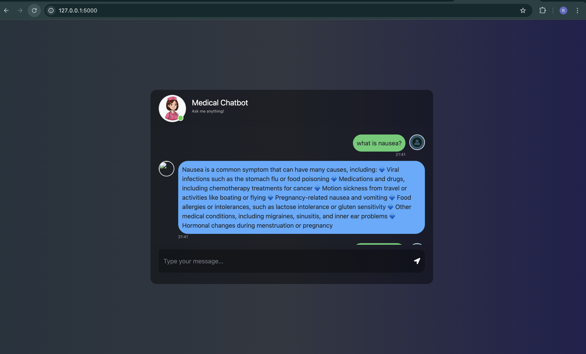

# 🩺 Medical Chatbot Using Llama2

A Medical Question-Answering chatbot built using **LLaMA-2**, **LangChain**, **Pinecone** as the vector database, and **Flask** for the web interface. The bot retrieves information from medical PDFs and provides accurate responses grounded in source content.

---

## 🚀 Features

✔ Retrieval-Augmented Generation (RAG) using medical PDFs  
✔ Local LLaMA-2 based inference (no cloud API required)  
✔ Semantic vector search using Pinecone  
✔ Clean Flask web interface  
✔ Easy to extend to new data sources  

---

## 📦 Prerequisites

Before running the project, ensure you have:

- **Python 3.10 or greater**  
- A **Pinecone API key** (free tier supported)  
- The medical PDF knowledge base (e.g., Gale Encyclopedia of Medicine)

---

## 🛠 Installation & Setup

### 1️⃣ Clone the repository

```bash
git clone https://github.com/renuvishwakarmatech-code/Medical-ChatBot
cd Medical-ChatBot
```

## 🛠 Installation & Setup

### 1️⃣ Clone the repository

```bash
git clone https://github.com/renuvishwakarmatech-code/Medical-ChatBot
cd Medical-ChatBot
```
### 2️⃣ Create a virtual environment

```bash
python3.11 -m venv mchatbot
```

```bash
source mchatbot/bin/activate
```

### 3️⃣ Install dependencies

```bash
pip install -r requirements.txt
```

### 4️⃣ Set up environment variables

```bash
PINECONE_API_KEY=your_pinecone_api_key
```

### 5️⃣ Download LLaMA-2 model
Download a GGUF quantized model (e.g., llama-2-7b-chat.Q4_K_M.gguf) and place it in the model/ directory.

You can get models from:

https://huggingface.co/TheBloke/Llama-2-7B-Chat-GGML

### 🧠 Build the Pinecone Index
Only run this once after setting up your PDF dataset:
```bash
python store_index.py
```
### 🚀 Run the Flask Web App

``` bash
python app.py
```
Open your browser and go to:
```bash
http://127.0.0.1:5000
```

### 🚀 App Screenshot


